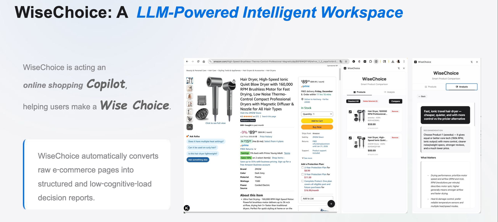
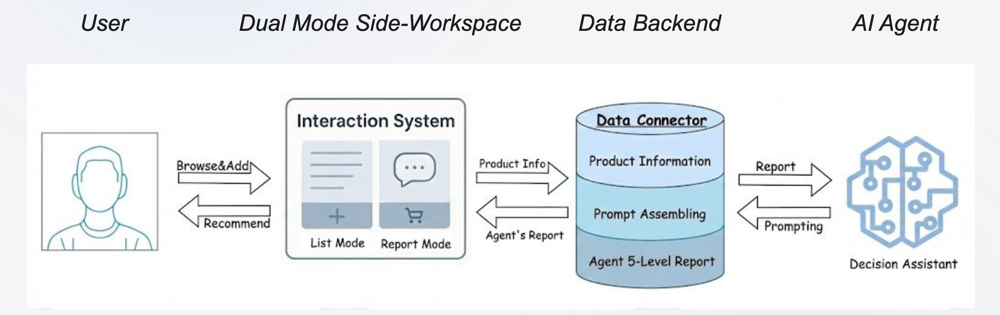
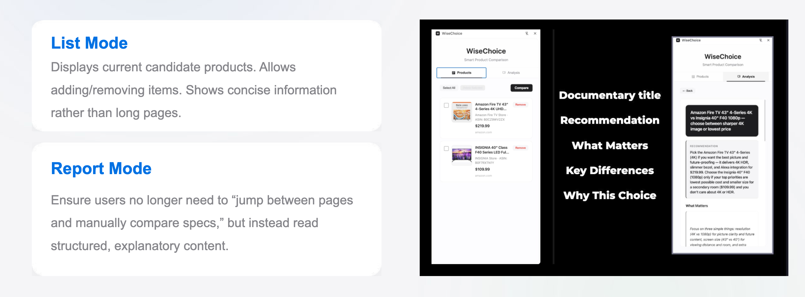

<div align="center">

<a id="readme-top"></a>

# WiseChoice

**网购时更快做决定。** WiseChoice 是一款 Chrome 扩展 + 本地 AI 服务：把散落在各标签页里的候选商品，收敛成一份清晰、可执行的对比结论——含一句话结论、决策框架与差异点——无需把浏览行为交给第三方控制台。**默认集成亚马逊**，但后端对比与架构 **不限定站点**；若要支援其他网址，请用 AI 编程 Agent 打开仓库，并把 **[AI 原生：扩展到其他站点](#ai-native-multistore)** 中代码框里的内容 **作为用户消息粘贴发送给 AI**（由你输入，不是程序执行）。

<p>
  <a href="./LICENSE"></a>
  
  
</p>

**其他语言：** [English](README.md)

</div>

---

## 观看演示

**PDF** 在 GitHub 上一般可直接在浏览器里打开。**视频**若希望访客**尽量在网页里直接看**、而不是依赖「先下载再播放」，请在公开仓库前按下面两种方式之一配置 `<source src>`：仅用仓库相对路径时，README 里的 `<video>` **经常无法在页面内稳定播放**，属于 GitHub 的限制。

### 在 README 里嵌入 MP4（公开前建议先做好）

1. **Raw 直链** — 仓库公开后，将 `<source src>` 写为  
   `https://raw.githubusercontent.com/<用户名>/<仓库名>/<分支>/asset/WiseChoice%20showcase.mp4`，长视频同理（分支如 `main`）。
2. **Issue 附件链接** — 新建 Issue（例如标题「README 媒体」），在**评论里上传**各 `.mp4` 并发表，复制评论里生成的 `https://user-images.githubusercontent.com/…mp4`，写入 README 的 `<video><source src="…">`。该 CDN 链接在 README 里**最容易内嵌播放**。

若下方播放器空白，可点 **[短片（GitHub 文件页）](asset/WiseChoice%20showcase.mp4)**、**[完整演示（GitHub 文件页）](asset/WiseChoice.mp4)** — 文件页通常带**浏览器内播放器**，不必强调「下载后观看」。

**短片预告**

<p align="center">
  <video width="100%" style="max-width:720px" controls preload="metadata" playsinline muted>
    <source src="asset/WiseChoice%20showcase.mp4" type="video/mp4" />
  </video>
</p>

**完整演示**

<p align="center">
  <video width="100%" style="max-width:720px" controls preload="metadata" playsinline muted>
    <source src="asset/WiseChoice.mp4" type="video/mp4" />
  </video>
</p>

**文档（PDF）**

| | |
| --- | --- |
| [WiseChoice Document.pdf](asset/WiseChoice%20Document.pdf) | 书面报告：问题、设计、技术叙述。 |
| [WiseChoice 幻灯片（PDF）](asset/WiseChoice_%20Slide.pdf) | 演讲/答辩用幻灯片稿。 |

---

## 截图

**Hero 页** — 产品定位与主叙事。

<p align="center">
  
</p>

**系统设计图** — 扩展、本地服务与模型协作关系。

<p align="center">
  
</p>

**侧边栏界面** — **列表模式（List mode）** 管理候选，**报告模式（Report mode）** 展示结构化 AI 对比结论。

<p align="center">
  
</p>

---

<a id="ai-native-multistore"></a>

## AI 原生：扩展到亚马逊以外的站点

WiseChoice **最初是为亚马逊** 商品页的字段与权限准备的，但整体是：**浏览器侧采集结构化候选**，**本地 FastAPI + 大模型** 负责对比——其他站点在技术上可按同样模式扩展。若你要 **换站点、加域名或多站并存**，请在 **AI 编程 Agent**（如 Cursor、GitHub Copilot、Claude Code、Windsurf 等）中打开本仓库，**将下方代码框中的整段文字复制到对话框，作为你发给 AI 的一条用户消息发送**（不是仓库自动执行的配置）。**请遵守各平台服务条款、适用法律及自动化/数据采集相关政策**；本说明不鼓励规避规则或未经授权的大规模抓取。

**用户发给 AI 的 Prompt（由你输入）：**

> 以下整段是 **你** 对编程助手说的话，不是扩展或服务会读取的配置。

```text
You are helping extend the WiseChoice Chrome extension (this repository). It is currently scoped for Amazon product detail pages; I want to add or switch to other target storefronts. Respect each target site’s Terms of Service and applicable law; do not implement bulk scraping or evasion patterns unless the user explicitly has the right to do so.

Follow this workflow in order. Do not skip steps 1–3. If anything is unclear, ask me (the human) before guessing.

1) Interview me first (proactive questions)
   - Ask which exact target site(s) I want: domains, URL patterns (e.g. only product detail URLs), and whether I also need listing/search pages.
   - Ask for 1–3 real example product URLs on the target site to use as ground truth.
   - Summarize what you understood and wait for my explicit confirmation (“yes, proceed”) before you write extraction code or edit files.

2) Audit the existing Amazon pipeline (read-only, then summarize)
   - Read manifest.json, content.js, background.js, and any helpers tied to capture.
   - Build a field map: each value WiseChoice collects today (title, price raw/amount, bullets, specs/tech map, stable product id such as ASIN or URL fingerprint, primary image URL, source URL, etc.).
   - For each field, state where it comes from on Amazon: CSS selectors, DOM structure, JSON-LD / microdata / Open Graph meta in the document, regex heuristics, etc. Clarify: we care about data embedded in the HTML page and DOM (what a content script can read). Do not confuse this with optional HTTP response headers unless the product data truly lives there (rare for retail pages).

3) Plan the target site (after I confirm in step 1)
   - For each row in the field map, propose where the equivalent data lives on my target site (candidate selectors, JSON-LD blocks, meta tags, fallbacks).
   - If you cannot see the live DOM, ask me to paste DevTools Elements snippets or “View Page Source” fragments for the title, price, bullets, and main image regions—or to validate selectors you hypothesize.

4) Implement only after steps 1–3 are done
   - Update manifest.json: host_permissions and content_scripts "matches" for my confirmed domains. Keep http://localhost:8765/* for the local AI service.
   - Update content.js (and CSS if needed) so the extracted object matches the same shape already sent to background.js today.
   - Preserve the message flow to background.js and the POST /api/compare contract (api_server.py / agent.py). Only change the API if unavoidable; document migrations.

5) Deliverables
   - List every file changed and why.
   - Show the before (Amazon) vs after (target) field map.
   - Manual test steps on a real product page I can follow.
   - Note layout variants (e.g. regional subdomains, A/B tests) and what is out of scope for v1.

If my answers are incomplete, ask follow-up questions until you can implement safely.
```

（说明：Prompt 正文建议保持英文便于模型执行；步骤 1 会促使 AI **先问你**目标网站与示例链接，**得到你明确确认后再改代码**；步骤 2–3 要求对照现有代码里页面内 **DOM / 选择器 / 结构化数据** 的采集方式，再映射到目标站——不是网络请求里的 HTTP Header，除非数据真的在 Header 里。）

---

## 为什么选择 WiseChoice

| 面向购物者 | 面向开发者 |
| --- | --- |
| 浏览时随手收录候选，告别复制粘贴表格。 | **本地优先 AI：** 使用你自己的 OpenAI 密钥，服务默认跑在 `http://localhost:8765`。 |
| 在侧边栏里对比两件或三件商品。 | 结构化输出：**标题**、**TL;DR**、**策略**、**分析**、**理由**。 |
| 得到「结论导向」的报告，而不是又一串无关要点。 | AI 服务未启动时，仍有**基础对比**与启动提示。 |

## 功能概览

- **一键采集** 亚马逊商品页：标题、价格、要点、规格、ASIN、图片等。
- **候选列表** 持久保存，并按商品 `id` 去重（优先 ASIN，否则 URL 指纹）。
- **侧边栏对比** 勾选两件或以上即可生成报告。
- **AI 决策引擎**（FastAPI + OpenAI）输出结构化、面向决策的叙述。
- **韧性体验：** 本地服务不可用时仍可看基础对比（价格区间、品牌、共有卖点等）。

## 使用流程

1. **浏览** — 在支持的亚马逊域名上，用悬浮按钮把当前商品加入清单。  
2. **整理** — 打开扩展侧边栏，管理、去重并勾选候选。  
3. **对比** — 本地 AI 服务运行时生成完整报告；否则使用内置的基础对比。

## 快速开始

### 1. 加载 Chrome 扩展

1. 打开 `chrome://extensions/`  
2. 开启 **开发者模式**  
3. **加载已解压的扩展** → 选择本仓库目录  

### 2. 启动本地 AI 服务

建议使用 Python **3.11** 或 **3.12**。

```bash
cd /path/to/WiseChoice-Release
python3 -m venv venv && source venv/bin/activate   # Windows: venv\Scripts\activate
pip install -r requirements.txt

export OPENAI_API_KEY="你的密钥"   # 或使用本地 .env（参考 .env.example）

python api_server.py
# 或: bash start_ai_service.sh
```

- 服务地址：`http://localhost:8765`  
- API 文档：`http://localhost:8765/docs`  

### 3. 开始使用

打开任意支持的亚马逊商品详情页，采集商品，打开侧边栏，至少勾选 **两件** 商品后点击 **Compare（对比）**。

## 架构概览

| 层级 | 职责 |
| --- | --- |
| **扩展 (MV3)** | `content.js` 抽取商品数据；`background.js` 存储候选；`sidebar.*` 为对比界面；`manifest.json` 配置权限与侧边栏。 |
| **本地服务** | `api_server.py` 提供 `POST /api/compare`；`agent.py` 按 JSON Schema 调用模型，生成 `title` / `tldr` / `strategy` / `analysis` / `reasons`。 |

扩展直接请求 `http://localhost:8765`。开发环境下 CORS 较宽松，请在可信环境运行服务。

## 本地 API 摘要

| 接口 | 说明 |
| --- | --- |
| `GET /` | 服务状态与版本 |
| `GET /api/health` | `{ "status": "healthy" }` |
| `POST /api/compare` | 请求体 `{ "products": [ ... ] }`，完整模式见 `/docs` |

成功响应示例：

```json
{
  "title": "...",
  "tldr": "...",
  "strategy": "...",
  "analysis": "...",
  "reasons": "...",
  "success": true
}
```

## 数据、隐私与安全

- **存储：** `chrome.storage.local`，键名 `wisechoice:candidates`。  
- **权限：** `storage`、`activeTab`、`scripting`、`sidePanel`；以及配置的亚马逊域名与 `http://localhost:8765/*`。  
- **密钥：** 使用环境变量 `OPENAI_API_KEY`，切勿提交到仓库；可参考 `.env.example` 自建 `.env` 且勿入库。  
- **网络：** 默认服务可能监听 `0.0.0.0`；若仅需本机访问，可在 `api_server.py` 中改为 `127.0.0.1`。  

## 仓库结构

```
WiseChoice-Release/
├── asset/                 # PDF（Document、Slide）、演示视频、截图（heropage、systemdesign、dualmode）
├── manifest.json
├── content.js / content.css
├── background.js
├── sidebar.html / sidebar.js / sidebar.css
├── api_server.py
├── agent.py
├── requirements.txt
├── start_ai_service.sh
├── README.md
├── README.zh-CN.md
└── …
```

## 免责声明

WiseChoice 为**独立开源项目**，与 **Amazon、OpenAI、Google** 及任何电商平台**无隶属、赞助或背书关系**；商标归权利人所有。文中提及 **Amazon** 仅说明默认集成场景。你对第三方网站与 API 的使用须自行承担合规责任。

## 许可证

本项目采用 **MIT License**，详见 [`LICENSE`](./LICENSE)。
